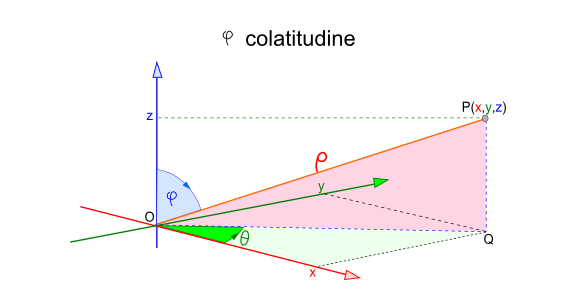

# MarsRoverAPI
Demo for Driving System of Mars Rover: You’re part of the team that explores Mars by sending remotely controlled vehicles to the surface of the planet. 
The scope is developing an API that translates the commands sent from earth to instructions that are understood by the rover.

# Requirements
You are given the initial starting point (x,y) of a rover and the direction (N,S,E,W) it is facing.
- The rover receives a character array of commands.
- Implement commands that move the rover forward/backward (f,b).
- Implement commands that turn the rover left/right (l,r).
- Implement wrapping from one edge of the grid to another. (planets are spheres after all)
- Implement obstacle detection before each move to a new square. If a given sequence of commands encounters an obstacle, the rover moves up to the last possible point, aborts the sequence and reports the obstacle.

# Implementation
the implementation is divided into Domain Assembly nad WebAPI Port; So fa, you find 3 projects in the repository:
- MarsRover.Driving: Domain assembly, that implement the domain logic related to driving system
- MarsRover.Driving.Api: Web API that exposes Domain API following REST pattern

## Domain Implementation
the domain exposes only Domain Services (public classes / interfaces):
- _IDrivingService_: it exposes capabilities related to Driving system; example: give proper command to rover
- _ISettingService_: it exposes capabilities to get or update settings of driving system
- _IDataService_: it exposes capabilities to set proper data, used by systme, like set obstacles that rover has to manage

### Coordinates
the commands to the rover can be specified in a "human being" format: 
- Direction: setting "F" for Forward, "B" for Backward
- Side: setting "L" for left, "R" for right
we are assuming the radius of Mars planet is set to 1 Unit.

the Driving sistem can get you the actual position of rover also in spherical coordinates. to transate cartesian to spherical coordinates we made a simplification: the moving of rovers are infinite less than radius, so we can assume taht carsian position (X, Y) are pretty much the same coorindates in spherical.

## API
the api is modeled based on domain services, since its role is only exposing over the web with REST pattern the domain capabilities:
- Driving: at this resouce you can specify commandas to rover or get/Set settings
- DataManagement: at this resource you can set the obstacles

the swagger file is accessible to the path: _/swagger/v1/swagger.json_
